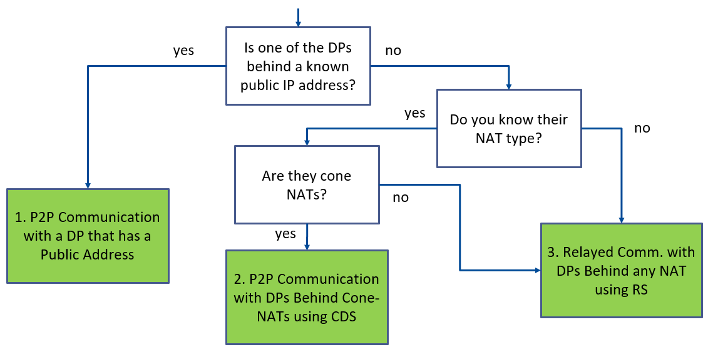

# Demo 3 - Teleoperation with RTI Real-Time WAN Transport

Demo 3 demonstrates teleoperation across the Wide Area Network (WAN) using the RTI Real-Time WAN Transport. This transport plugin enables DDS communication across the WAN using UDP as the underlying transport-layer protocol.

This demo shows how the Surgeon Console from [Demo 1 - Digital Operating Room](../demo1/) can be located anywhere in the world and continue to communicate with the rest of the system. Be sure you are able to run Demo 1 before trying out this demo.

## Contents

- [Demo Description](#demo-description)
- [Run the Demo](#run-the-demo)
- [Hands-On: Going Further](#hands-on-going-further)
- [Next Steps](#next-steps)

## Demo Description

This demo extends the Digital Operating Room from Demo 1 to demonstrate WAN communication capabilities. The RTI Real-Time WAN Transport enables secure, reliable communication across geographical distances, allowing medical professionals to operate remotely while maintaining real-time control and monitoring.


WAN communication can be deployed in 3 different scenarios:

1. [Scenario 1](Scenario1.md): Direct Peer-to-Peer Communication with Public IP Address.
2. [Scenario 2](Scenario2.md): Direct Peer-to-Peer Communication Using [RTI Cloud Discovery Service](https://community.rti.com/static/documentation/connext-dds/7.3.0/doc/manuals/addon_products/cloud_discovery_service/index.html).
3. [Scenario 3](Scenario3.md): Relayed Communication Using [RTI Routing Service](https://community.rti.com/static/documentation/connext-dds/7.3.0/doc/manuals/connext_dds_professional/services/routing_service/index.html).

### RTI Real-Time WAN Transport

The RTI Real-Time WAN Transport provides a way for DDS traffic to traverse Network Address Translation (NAT) units - a foundational piece to the scalability and security of the Wide Area Network.
The Real-Time WAN Transport enables support for NAT traversal at the DDS layer, which in turn allows UDP to be leveraged as an underlying transport for lower latency and higher throughput.

Together, the RTI Real-Time WAN Transport, RTI Security Plugins, and RTI Cloud Discovery Service, offer a robust solution that provides:

- **Low-latency communication** across WAN connections
- **Automatic NAT traversal** capabilities
- **Secure data transmission** with built-in authentication, encryption and access control
- **Bandwidth optimization** for efficient data transfer (when compared to TCP-based communication)
- **Connection resilience** with automatic reconnection

## Run the Demo

For this demo, you will need the following:

1. Two machines connected to the WAN (not on the same LAN) that can run the Demo 1 applications.
2. Conditionally, a cloud instance that is publically reachable by both machines noted above. *This is required for Scenarios 2 and 3 described below.*

### 1. Determine Your Scenario

Refer to the following decision tree to understand which scenario best suits your environment:



To determine your NAT type, use the [NAT type checker](../../resource/nat_type_checker/) script on *each* remote machine:

```bash
python3 resource/nat_type_checker/nat_type_checker.py
```

### 2. Run Your Scenario

Select the appropriate scenario based on your network configuration:

- #### Scenario 1 - Direct Peer-to-Peer Communication with Public IP Address

    **Use if either machine is directly reachable at a public IP address.**

    Follow the detailed instructions in [Scenario1.md](Scenario1.md) to set up peer-to-peer communication with a public IP address.

- #### Scenario 2 - Direct Peer-to-Peer Communication Using RTI Cloud Discovery Service

    **Use if either machine is reachable behind a Cone NAT.**

    Follow the detailed instructions in [Scenario2.md](Scenario2.md) to set up communication using RTI Cloud Discovery Service for NAT traversal.

- #### Scenario 3 - Relayed Communication Using RTI Routing Service

    **Use if none of the scenarios above apply or you are unsure of your setup.**

    Follow the detailed instructions in [Scenario3.md](Scenario3.md) to set up relayed communication using RTI Routing Service.

## Hands-On: Going Further

Here is a hands-on exercise to explore WAN communication features and demonstrate RTI Connext capabilities across distributed networks.

### Connection Resilience

Test how the system handles network interruptions.

1. Run your chosen scenario and establish WAN communication.

2. Temporarily disconnect the network connection (e.g., disable WiFi).

3. Reconnect after 10-30 seconds.

    >**Observe:** DDS discovery across the WAN using the Real-Time WAN Transport should allow automatic reconnection and resume data flow without application-level intervention.

## Next Steps

Head back to the [main README](../../README.md) and pick up with the [Hands-On: Architecture](../../README.md#hands-on-architecture) section to learn more about the system architecture.
