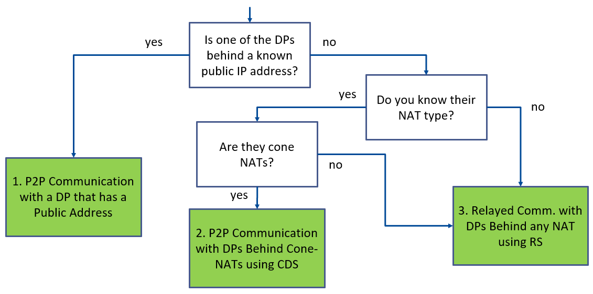

# Demo 3 - Teleoperation with RTI Real-Time WAN Transport

Demo 3 demonstrate Teleoperation across the Wide Area Network (WAN) with the
RTI Real-Time WAN Transport. This is a transport plugin that enables
communication WANs using UDP as the underlying IP transport-layer protocol.

This examples demonstrates that the Surgeon Console of the Digital Operating
Room from [Demo 1 - Digital Operating Room](../demo1/) can be anywhere in the
world and continue to communicate with the rest of the system.

WAN communication can be deployed in 3 different scenarios:

1. Peer-to-peer communication with a DomainParticipant that has a public IP address.
2. Peer-to-peer communication with DomainParticipants behind cone-NATs using.
3. Relayed communication with DomainParticipants behind any NAT using.

You can use this decision tree to decide what scenario suits your needs:

You can use the NAT type checker script in [resources/nat_type_checker](./resources/nat_type_checker)
if you need to use scenario 2, which requires cone NATs.

