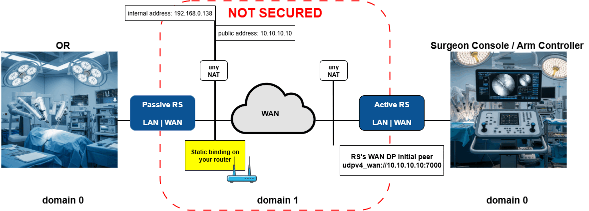
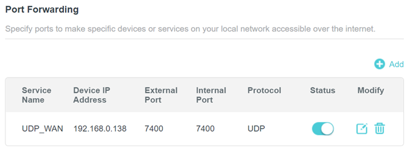

# Scenario 1: Direct Peer-to-Peer Communication with Public IP Address

This scenario demonstrates WAN communication when one DomainParticipant is reachable at a public IP address. This is the simplest WAN deployment scenario.

The *Passive* RTI Routing Service listens for incoming communications. The *Active* RTI Routing Service uses the known public address and port of the *Passive* side to initiate discovery.

In this scenario, only Domain 1 is secured. Demo 1 applications run in non-secured mode locally, while WAN communication uses authentication and encryption. In a production deployment, you may choose to secure the local traffic as well or just the remote traffic as demonstrated here.



## Setup and Installation

### 1. See Demo 1 Setup and Installation

[Installation and build steps from Demo 1](../demo1/README.md#setup-and-installation) satisfy prerequisites for this demo on both machines.

### 2. Install RTI Real-Time WAN Transport

The RTI Real-Time WAN Transport is available as an add-on product. Follow the [RTI Real-Time WAN Transport Installation Guide](https://community.rti.com/static/documentation/connext-dds/7.3.0/doc/manuals/addon_products/realtime_wan_transport/installation_guide/index.htm) to install the transport plugin on both machines.

### 3. Security (optional)

Generate security artifacts for WAN communication.
This includes identity certificates, private keys, and the signing of DDS Security XML permissions & governance files located in [demos/security](../security).

**You should generate the security artifacts once and then distribute to whichever machines are used to run the demo applications. This ensures the certificates can be corectly verified across machines during DomainParticipant authentication.**

### 4. Network Configuration

On both *Passive* and *Active* sides, configure these variables in [variables.sh](./scripts/variables.sh)/[variables.bat](./scripts/variables.bat):

| Variable         | Value                                                                                 | Default |
|------------------|---------------------------------------------------------------------------------------|---------|
| `NDDSHOME`       | RTI Connext installation path.                                                        |         |
| `PUBLIC_ADDRESS` | Publicly accessible IP address of the *Passive* side.                                 |         |
| `PUBLIC_PORT`    | Publicly accessible/forwarded port of the *Passive* side.                             | 10777   |
| `INTERNAL_PORT`  | Internal/forwarded port of the *Passive* side. This may be the same as `PUBLIC_PORT`. | 10777   |

You must then configure UDP port forwarding on your *Passive* side router between `PUBLIC_PORT` and `INTERNAL_PORT` to expose your DDS applications on the WAN.
For example:



## Run the Scenario

*Note: This scenario will not work if different certificate sets are used on each side when using Security.*

### 1. Launch Active Side Applications

From the machine *not* publicly exposed, start the teleop Arm Controller as the *Active* side:

```bash
cd demo1
./scripts/launch_arm_controller.sh
```

### 2. Launch Passive Side Applications

From the machine *publicly* exposed, start the Operating Room applications as the *Passive* side:

```bash
cd demo1
./scripts/launch_OR_apps.sh
```

>**Observe:** You should see **no communication** between applications since the Routing Service infrastructure has not been started yet.

### 3. Launch Passive Routing Service

In a new terminal on the *Passive* side:

```bash
cd demo3
./scripts/launch_rs_passive.sh [-s]
```

### 4. Launch Active Routing Service

In a new terminal on the *Active* side:

```bash
cd demo3
./scripts/launch_rs_active.sh [-s]
```

### 5. Observe Communication

[Observe the demo applications](../demo1/README.md#3-observe-the-demo-applications) to verify that all Demo 1 functionality works across the WAN.

>**Observe:** Once discovery completes, you should see data flow between the Operating Room applications and the Arm Controller. RTI Routing Service provides scalability by bridging between the local networks over the WAN and avoids managing a separate WAN connection for each set of remote applications that communicate.

### 6. Kill the demo applications

Kill all running applications:

```bash
# Kill Demo 1 applications
../demo1/scripts/kill_all.sh
```
