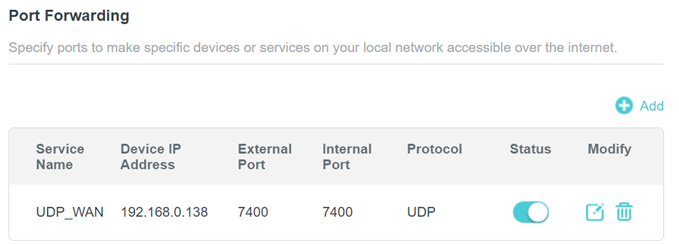
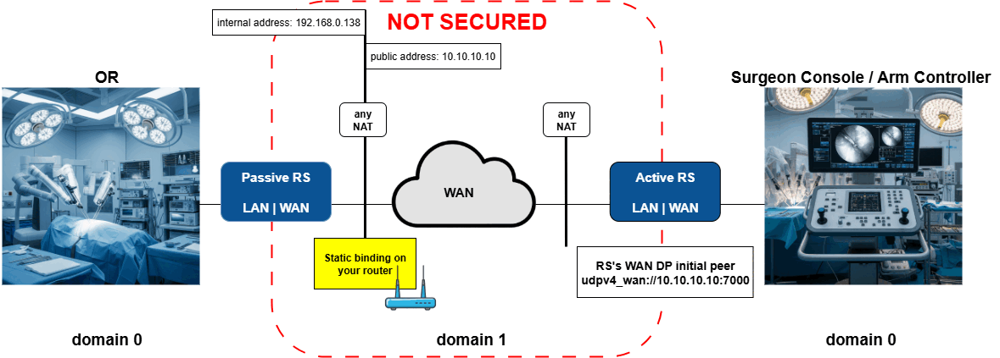

# Scenario 1: Peer-to-peer communication with a DomainParticipant that has a public IP address

## Requirements

Packages:

```plaintext
rti_connext_dds-7.3.0-pro-host-<architecture>.<run/exe>
rti_real_time_wan_transport-7.3.0-host-<architecture>.rtipkg
```

If using RTI Security Plugins, you'll also need these packages:

```plaintext
rti_security_plugins-7.3.0-host-openssl-3.0-<architecture>.rtipkg
openssl-3.0.12-7.3.0-host-<architecture>.rtipkg
```

With regards to network configuration, you'll need to set up a static mapping
of your _OR's_ router (could be a home office) between a `PUBLIC_PORT` and an
`INTERNAL_PORT`, for the UDP protocol. For instance:



## Diagram



The passive Routing Service will listen for incoming communications. The Active
Routing Service will use its initial peers to start the communication with the
Passive one. In the diagram above, the public address needs to be known by the
remote Active Routing Service.

As you can see, only domain 1 is secured. That means that for this demo, you
will run the different applications from demo 1 in their not-secured version. In
a real-world scenario, you may opt to secure the entire system, or just the WAN
part like in this demo.

## How to run this scenario

0. If you'd like to secure the WAN communication, run the following script.
Then, make sure both the _Passive_ and _Active_ sides are using the same set of
certificates. This demo won't work if the set of certificates are different on
each side:

    ```bash
    cd demos/security
    ./setup_security.sh
    ```

1. Start the Surgeon Console / Arm Controller on the _Active_ side:

    ```bash
    cd demo1
    ./scripts/launch_arm_controller.sh
    ```

2. Start the rest of the applications of the OR on the _Passive_ side:

    ```bash
    cd demo1
    ./scripts/launch_OR_apps.sh
    ```

3. You should see **no communication** between the Arm Controller and the rest
of the applications since the Routing Service infrastructure hasn't been started
yet.

4. On the _Passive_ and _Active_ side, set up these variables on the
`scripts/variables.sh` file:
    - `NDDSHOME`. Connext installation path.
    - `PUBLIC_ADDRESS`. Public IP address of the _Passive_ side.
    - `PUBLIC_PORT`. Public port on the _Passive_ side (based on your static
    mapping).
    - `INTERNAL_PORT`. Public port on the _Passive_ side (based on your static
    mapping). Could be the same as `PUBLIC_PORT`. This variable is only used
    by the _Passive_ Routing Service.

5. In a terminal on the _Passive_ side, run Routing Service:

    ```bash
    cd demo3
    ./scripts/launch_rs_passive.sh [-s]
    ```

6. In a terminal on the _Active_ side, run Routing Service:

    ```bash
    cd demo3
    ./scripts/launch_rs_active.sh [-s]
    ```

## Expected output

After a few seconds, once discovery is completed, you should see communication
between the OR applications and the Arm Controller. Actually, you could start
the applications on either side and the communication should keep flowing.
Routing Service helps with scalability because you do not need to initiate new
WAN connections per application, Routing Service will simply take care of that
for you.
