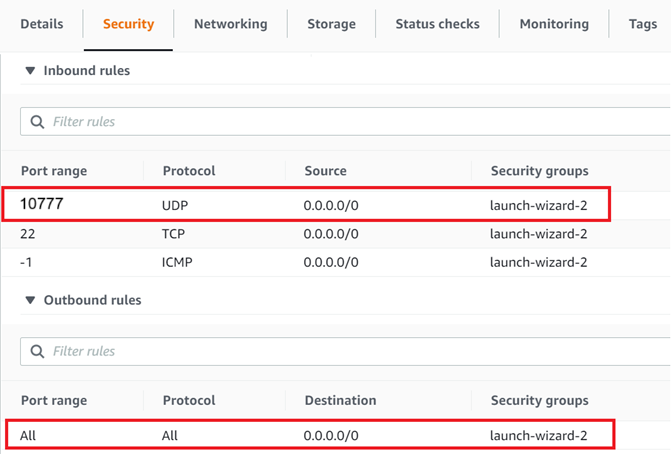

# Scenario 2: Direct Peer-to-Peer Communication Using RTI Cloud Discovery Service

This scenario demonstrates WAN communication when both DomainParticipants are behind cone NATs and cannot reach each other directly. RTI Cloud Discovery Service is run on a publicly accessible cloud instance to facilitate discovery between the *Active* RTI Routing Services.

The *Active* Routing Services initiate discovery towards the public *Cloud* instance. Cloud Discovery Service facilitates discovery between both NAT-protected *Active* Routing Services, which in turn establishes peer-to-peer communication.

In this scenario, only Domain 1 is secured. Demo 1 applications run in non-secured mode locally, while WAN communication uses authentication and encryption. In a production deployment, you may choose to secure the local traffic as well or just the remote traffic as demonstrated here.


## Setup and Installation

**This scenario requires the *OR's* and the *Arm Controller's* NATs to be cone NATs. You can use the NAT type checker script in [resource/nat_type_checker](../../resource/nat_type_checker) to make sure you have cone NATs.**

### 1. See Demo 1 Setup and Installation

[Installation and build steps from Demo 1](../demo1/README.md#setup-and-installation) satisfy prerequisites for this demo on both machines.

### 2. Install RTI Real-Time WAN Transport

RTI Real-Time WAN Transport is available as an add-on product. Follow the [RTI Real-Time WAN Transport Installation Guide](https://community.rti.com/static/documentation/connext-dds/7.3.0/doc/manuals/addon_products/realtime_wan_transport/installation_guide/index.htm) to install the transport plugin on both machines.

### 3. Setup Cloud Instance

On your publicly reachable cloud instance, install the RTI Connext host, the Real-Time WAN Transport, Cloud Discovery Service and RTI Security Plugins packages.

1. To install Connext host, follow the [installation guide](https://community.rti.com/static/documentation/connext-dds/7.3.0/doc/manuals/connext_dds_professional/installation_guide/installation_guide/Installing.htm#Chapter_1_Installing_RTI%C2%A0Connext) and install only the host bundle (there is no need to install a target bundle).
2. RTI Real-Time WAN Transport is available as an add-on product. Follow the [RTI Real-Time WAN Transport Installation Guide](https://community.rti.com/static/documentation/connext-dds/7.3.0/doc/manuals/addon_products/realtime_wan_transport/installation_guide/index.htm). to install the transport plugin. You will only need the host bundle.
3. Cloud Discovery Service is available as an add-on component. Follow the [RTI Cloud Discovery Service Installation Guide](https://community.rti.com/static/documentation/connext-dds/7.3.0/doc/manuals/addon_products/cloud_discovery_service/installation.html).
4. If using Security, install the host bundle for both OpenSSL and RTI Security Plugins.

### 4. Security (optional)

Generate security artifacts for WAN communication.
This includes identity certificates, private keys, and the signing of DDS Security XML permissions & governance files located in [demos/security](../security).

**You should generate the security artifacts once and then distribute to whichever machines are used to run the demo applications. This ensures the certificates can be correctly verified across machines during DomainParticipant authentication.**

### 6. Network Configuration

On the *Active* sides and on your cloud instance, configure these variables in [variables.sh](./scripts/variables.sh)/[variables.bat](./scripts/variables.bat):

| Variable         | Value                                                                                 | Default |
|------------------|---------------------------------------------------------------------------------------|---------|
| `NDDSHOME`       | RTI Connext installation path.                                                        |         |
| `PUBLIC_ADDRESS` | Publicly accessible IP address of the cloud instance.                                 |         |
| `PUBLIC_PORT`    | Publicly accessible/forwarded port of the cloud instance.                             | 10777   |

You will need to add a security rule on your cloud instance to allow incoming/outgoing traffic on `PUBLIC_PORT` for the UDP protocol. For example:



## Run the Scenario

*Note: This scenario will not work if different certificate sets are used on each side when using Security.*

### 1. Launch Active Side Applications

From one machine, start the teleop Arm Controller:

```bash
cd demo1
./scripts/launch_arm_controller.sh
```

### 2. Launch Passive Side Applications

From the other machine, start the Operating Room applications:

```bash
cd demo1
./scripts/launch_OR_apps.sh
```

>**Observe:** You should see **no communication** between applications since the Routing Service and Cloud Discovery Service infrastructure has not been started yet.

### 3. Security Configuration (if using Security)

If using Security, on the *Active* sides, uncomment lines 68-79 of [`RsConfigActive.xml`](xml_config/RsConfigActive.xml). This is necessary to allow secure communication with Cloud Discovery Service.

### 4. Launch Cloud Discovery Service

In a terminal on your cloud instance, run Cloud Discovery Service:

```bash
cd demo3
./scripts/launch_cds_cloud.sh [-s]
```

### 5. Launch Active Routing Services

Open a new terminal on both *Active* sides and run the following in each:

```bash
cd demo3
./scripts/launch_rs_active.sh [-s]
```

### 6. Observe Communication

[Observe the demo applications](../demo1/README.md#3-observe-the-demo-applications) to verify that all Demo 1 functionality works across the WAN.

>**Observe:** Once discovery completes, you should see data flow between the Operating Room applications and the Arm Controller. RTI Cloud Discovery Service facilitates discovery between the *Active* Routing Services, allowing them to establish peer-to-peer communication. RTI Routing Service provides scalability by bridging between the local networks over the WAN and avoids managing a separate WAN connection for each set of remote applications that communicate.

### 7. Kill the demo applications

Kill all running applications:

```bash
# Kill Demo 1 applications
../demo1/scripts/kill_all.sh
```
