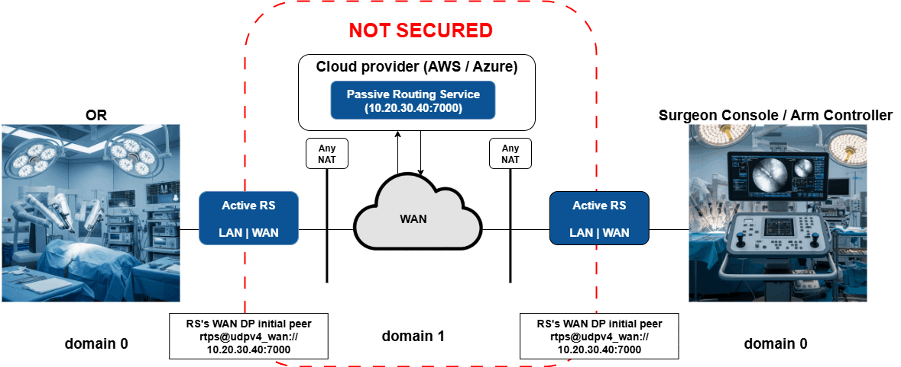

# Scenario 3: Relayed communication with DomainParticipants behind any NAT using Routing Service

## Requirements

Packages:

```plaintext
rti_connext_dds-7.3.0-pro-host-<architecture>.<run/exe>
rti_real_time_wan_transport-7.3.0-host-<architecture>.rtipkg
```

If using RTI Security Plugins, you'll also need these packages:

```plaintext
rti_security_plugins-7.3.0-host-openssl-3.0-<architecture>.rtipkg
openssl-3.0.12-7.3.0-host-<architecture>.rtipkg
```

This scenario does **not** require the _OR's_ and the _Arm Controller's_ NATs to
be cone NATs.

With regards to network configuration, you'll need to add a security rule on
your AWS instance to allow incoming / outgoing traffic on `PUBLIC_PORT` for the
UDP protocol. For instance:


## Diagram



The cloud _Passive_ Routing Service will listen for incoming communication. The
_Active_ Routing Services will use their initial peers to start the
communication with the _Cloud_ one. The _Cloud_ Routing Service will relay the
communication. In the diagram above, the public address needs to be known by the
remote _Active_ Routing Services.

As you can see, only domain 1 is secured. That means that for this demo, you
will run the different applications from demo 1 in their not-secured version. In
a real-world scenario, you may opt to secure the entire system, or just the WAN
part like in this demo.

## How to run this scenario

0. If you'd like to secure the WAN communication, run the following script,
unless you've already run it for a different scenario. Then, make sure both
_Active_ sides and the _Cloud_ Routing Service are using the same set of
certificates. This demo won't work if the set of certificates are different on
each side:

    ```bash
    cd demos/security
    ./setup_security.sh
    ```

1. Start the Surgeon Console / Arm Controller on one side:

    ```bash
    cd demo1
    ./scripts/launch_arm_controller.sh
    ```

2. Start the rest of the applications of the OR on the other side:

    ```bash
    cd demo1
    ./scripts/launch_OR_apps.sh
    ```

3. You should see **no communication** between the Arm Controller and the rest
of the applications since the Routing Service infrastructure hasn't been
started yet.

4. On the _Active_ and _Cloud_ sides, set up these variables on the
`scripts/variables.sh` file:
    - `NDDSHOME`. Connext installation path.
    - `PUBLIC_ADDRESS`. Public IP address of your cloud instance.
    - `PUBLIC_PORT`. Public port of your cloud instance (based on your security
    rule).
    - `INTERNAL_PORT`. Public port on the _Passive_ side (based on your static
    mapping). Could be the same as `PUBLIC_PORT`. This variable is only used
    by the _Cloud_ Routing Service.

5. On the _Active_ sides, make sure that lines 67-74 of
[`RsConfigActive.xml`](xml_config/RsConfigActive.xml) are commented out.

6. In a terminal on your cloud instance, run Routing Service:

    ```bash
    cd demo3
    ./scripts/launch_rs_cloud.sh [-s]
    ```

7. Open a terminal on the two _Active_ sides and run the following on both:

    ```bash
    cd demo3
    ./scripts/launch_rs_active [-s]
    ```

## Expected output

After a few seconds, once discovery is completed, you should see communication
between the OR applications and the Arm Controller. Actually, you could start
the applications on either side and the communication should keep flowing.
Routing Service helps with scalability because you do not need to initiate new
WAN connections per application, Routing Service will simply take care of that
for you.
