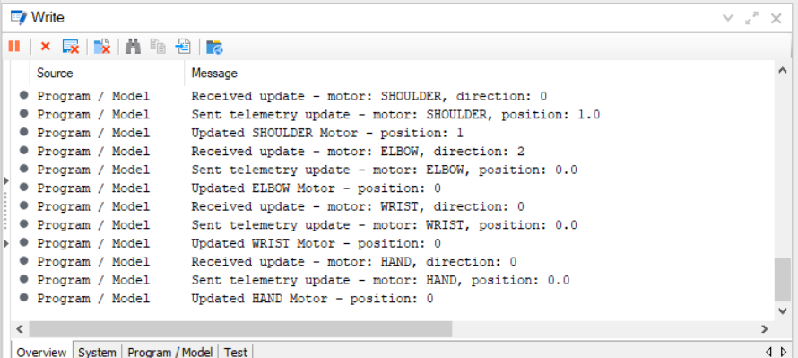
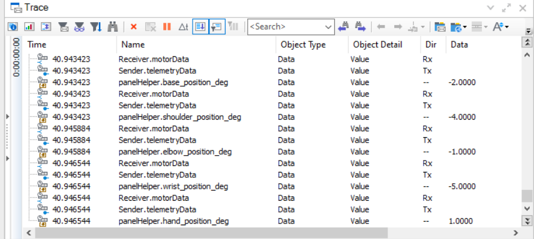
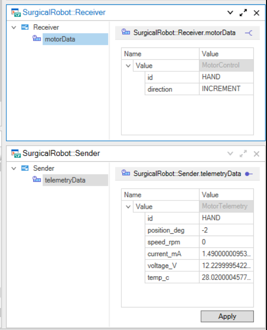
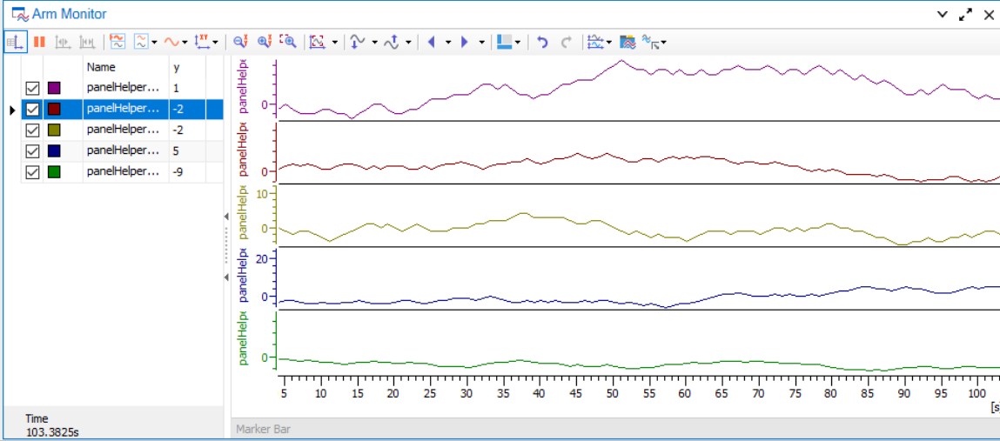
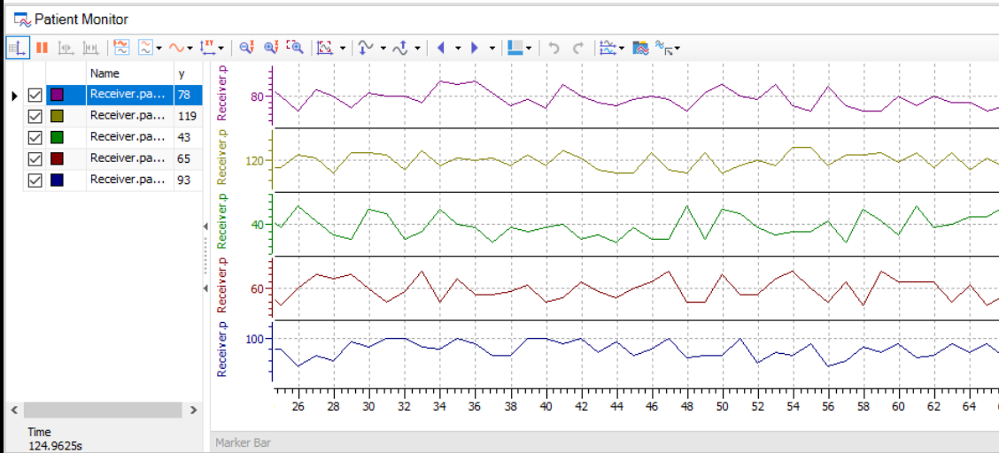
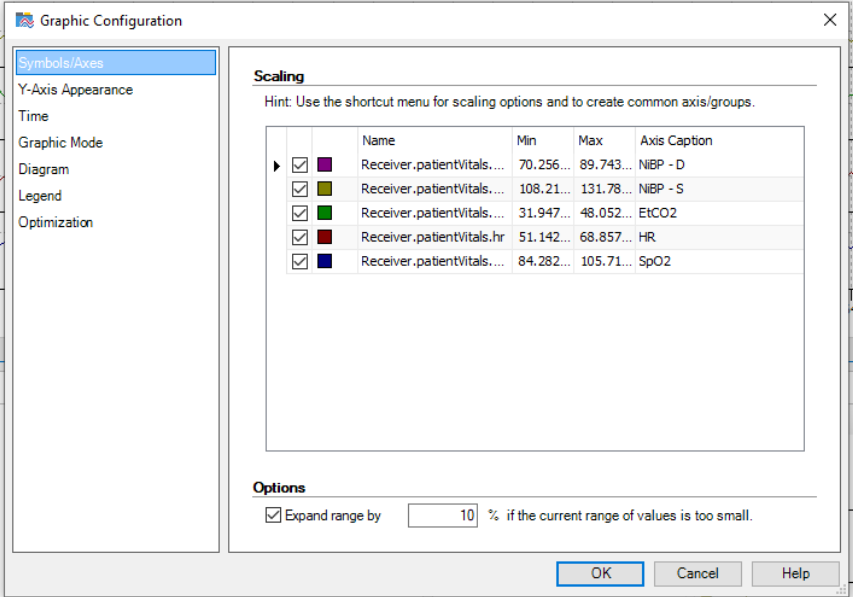
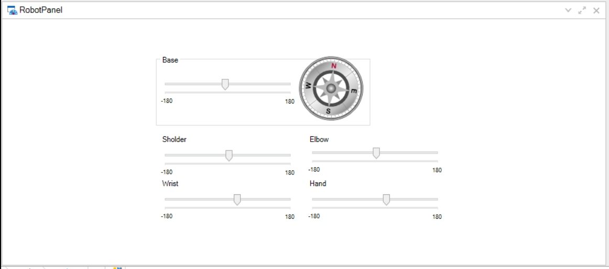
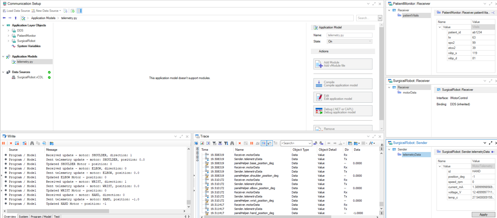
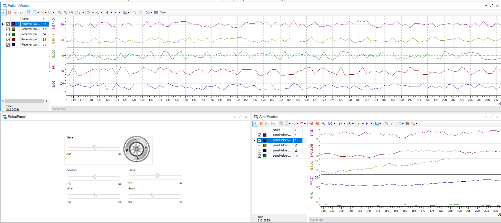

# Vector CANoe Integration — RTI MedTech Reference Architecture

This example demonstrates a Vector CANoe integration that leverages CANoe's native Python scripting capabilities to create a bidirectional bridge between multiple DDS domains, enabling both topic translation and domain bridging while providing real-time monitoring and control capabilities.

Unlike the standalone [telemetry_bridge](../telemetry_bridge) application included with the RTI MedTech Reference Architecture, this CANoe-based solution brings the bridge logic into the analysis platform itself, eliminating the need for separate executable processes. This approach provides several advantages: unified monitoring through CANoe's built-in visualization tools, simplified deployment in integrated test environments, and real-time synchronization between control inputs and telemetry outputs within a single software ecosystem.

See the project root [README.md](../../README.md) for overall architecture and how this example fits in.

## Contents

- [Example Description](#example-description)
- [Setup and Installation](#setup-and-installation)
- [Run the Example](#run-the-example)
- [Interactive Control Panel](#interactive-control-panel)
- [Monitoring and Debugging](#monitoring-and-debugging)
- [Visualization and Graphical Analysis](#visualization-and-graphical-analysis)
- [Multi-Desktop Workspace Configuration](#multi-desktop-workspace-configuration)
- [Integration with Operating Room Module](#integration-with-operating-room-module)
- [Use Cases](#use-cases)

## Example Description

This example implements a Vector CANoe integration for the surgical robot arm and patient monitoring. The system consists of:

### Data Flow and Domain Bridging

The integration implements a multi-layer data handling system:

- **Input Domain (Domain 0):** Receives `MotorControl` commands on the `t/MotorControl` topic, compatible with control signals from the Arm Controller application
- **Output Domain (Domain 6):** Publishes `MotorTelemetry` updates on the `topic/MotorTelemetry` topic with simulated sensor data
- **Monitoring Domain (Domain 0):** Subscribes to patient vital signs on the `t/Vitals` topic for integrated monitoring

### DDS Data Structures

The integration defines two primary DDS types via the [SurgicalRobot.vCDL](SurgicalRobot.vCDL) specification:

#### MotorControl Structure

Used for sending motor control commands from the Arm Controller:

- **id** (Motors enum): Target motor identifier (BASE, SHOULDER, ELBOW, WRIST, HAND)
- **direction** (MotorDirections enum): Movement direction (STATIONARY, INCREMENT, DECREMENT)

#### MotorTelemetry Structure

Published in response to motor commands with simulated sensor readings:

- **id** (Motors enum): Source motor identifier
- **position_deg** (float): Current angular position in degrees (normalized to ±180°)
- **speed_rpm** (float): Motor rotational speed
- **current_mA** (float): Current draw in milliamps
- **voltage_V** (float): Supply voltage
- **temp_c** (float): Motor temperature in Celsius

#### Vitals Structure

Monitored from patient monitoring systems:

- **patient_id** (string): Key identifier for the patient
- **hr** (uint32): Heart rate in beats per minute
- **spo2** (uint32): Peripheral oxygen saturation percentage
- **etco2** (uint32): End-tidal CO₂ in mmHg
- **nibp_s** (uint32): Systolic non-invasive blood pressure
- **nibp_d** (uint32): Diastolic non-invasive blood pressure

### Quality of Service (QoS) Configuration

The integration employs differentiated QoS policies appropriate to each data flow:

- **Motor Control Subscription:** RELIABLE reliability with KEEP_ALL history for guaranteed command delivery
- **Telemetry Publication:** BEST_EFFORT reliability with KEEP_ALL history for efficient streaming of sensor data
- **Vital Signs Subscription:** BEST_EFFORT reliability appropriate for periodic vital sign updates

### Python Integration Script

The core integration logic resides in [telemetry.py](telemetry.py), a Vector CANoe measurement script that implements:

#### Motor Control Processing

The script subscribes to incoming `MotorControl` messages and processes motor movement commands with the following capabilities:

- **Smooth Motion Emulation:** Converts discrete INCREMENT/DECREMENT directives into smooth, continuous angular position updates using single-degree increments
- **Angle Normalization:** Maintains motor positions within the standard ±180° range using modulo-based normalization
- **Dual-Source Synchronization:** Seamlessly reconciles control signals from both the Arm Controller and the CANoe control panel, preventing position jumps through careful state management

#### Telemetry Generation

Upon each motor control update, the script generates realistic telemetry data:

- Real-time position tracking with configurable step resolution (default 1.0°)
- Simulated sensor readings with realistic ranges:
  - Current: 1.0–1.5 mA
  - Voltage: 12.0–12.5 V
  - Temperature: 26–29°C

#### User Interface Integration

The script monitors a `panelHelper` interface structure that provides real-time synchronization with CANoe's interactive control panel:

- **Bi-directional Synchronization:** Panel slider movements trigger motor control commands; motor position updates automatically reflect in panel controls
- **Visual Feedback:** All state changes are logged to the CANoe Write window for real-time debugging and monitoring
- **Seamless Multi-Source Control:** The Arm Controller and CANoe panel can be operated together without state conflicts

## Setup and Installation

### 1. Install Dependencies

This example requires:

- [Vector CANoe with DDS support](https://www.vector.com/us/en/products/products-a-z/software/canoe/option-dds/#)
- [RTI Connext 7.3.0](https://community.rti.com/static/documentation/connext-dds/7.3.0/doc/manuals/connext_dds_professional/installation_guide/installation_guide/Installing.htm#Chapter_1_Installing_RTI%C2%A0Connext)

### 2. Configure CANoe Project

Ensure the CANoe configuration file [RTIMedTech.cfg](RTIMedTech.cfg) is properly configured with the correct paths to:

- DDS type definitions ([SurgicalRobot.vCDL](SurgicalRobot.vCDL))
- Python measurement script ([telemetry.py](telemetry.py))
- Control panel ([RobotPanel.xvp](RobotPanel.xvp))

### 3. Configure Environment

Ensure RTI Connext DDS environment variables are configured and accessible to CANoe.

## Run the Example

### 1. Open CANoe Configuration

Open the [RTIMedTech.cfg](RTIMedTech.cfg) configuration file in Vector CANoe.

### 2. Start Measurement

Start the CANoe measurement to begin the integration:

>**Observe:** The integration will subscribe to motor control commands and publish telemetry to Domain 6. The control panel provides interactive control of the robot arm motors. All state changes are logged to the CANoe Write window for real-time debugging and monitoring.

## Interactive Control Panel

The [RobotPanel.xvp](RobotPanel.xvp) graphical interface provides real-time control and monitoring of all five robotic arm joints:

### Control Elements

- **Base Rotation:** Directional compass display with ±180° slider control
- **Shoulder, Elbow, Wrist, Hand Joints:** Individual position sliders with real-time value display

### User Interaction Model

Operators adjust motor positions using the panel sliders, which directly trigger motor control messages on the DDS network. The integration script processes these commands and publishes corresponding telemetry updates, creating a real-time feedback loop. This design enables:

- Rapid manual testing of robotic arm behavior
- Real-time visual verification of motion commands
- Integration testing with external Arm Controller instances
- Demonstration of CANoe's suitability for real-time medical device control systems

## Monitoring and Debugging

The integration provides multiple levels of observability:

### Write Window Output

Detailed debug logging captures all significant events:

The script outputs human-readable messages for:

- Incoming motor control commands with direction and motor identification
- Outgoing telemetry updates with calculated positions
- Motor position updates triggered via panel controls
- Error conditions with detailed exception information

### DDS Trace Window

Raw DDS network activity is visible at the middleware level:

Provides insight into:

- Topic subscription and publication events
- Message transmission and reception timing
- QoS policy violations or negotiation issues
- Domain participant lifecycle events

### DataSource Windows

Real-time monitoring of data values at the application level:

Displays current values for:

- Motor control inputs (topic: `t/MotorControl`, domain: 0)
- Motor telemetry outputs (topic: `topic/MotorTelemetry`, domain: 6)
- Patient vital signs (topic: `t/Vitals`, domain: 0)

## Visualization and Graphical Analysis

### Motor Telemetry Dashboard

Real-time graphs track motor behavior metrics with time-series visualization. Operators can monitor motor positions, velocities, currents, voltages, and temperatures simultaneously across all five joints:

### Patient Monitoring Dashboard

Parallel visualization of vital signs with configurable axis parameters enables clinical staff to monitor patient status while robotic procedures are underway:

#### Configuring Graph Axis Parameters

The patient monitor graph's axis labels and ranges can be customized via CANoe's configuration dialog:

This customization capability allows adaptation to different monitoring protocols and clinical requirements.

### Control Panel Integration

The RobotPanel provides an integrated view combining manual controls and live status indicators:

## Multi-Desktop Workspace Configuration

The integration defines two specialized desktops to optimize different operational workflows:

### Desktop 1: Comprehensive System View

Organized for detailed system analysis and testing, displaying:

- Motor control and telemetry graphs (60% of display)
- Dual monitoring panels for patient vital signs and arm status
- Trace and Write windows for debugging
- DataSource windows for real-time value inspection

### Desktop 2: Operator Control View

Streamlined layout emphasizing the interactive robot panel and key monitoring displays:

- Prominent RobotPanel for intuitive motor control
- Patient vital signs graph
- Arm telemetry monitoring
- Minimal secondary windows to reduce visual clutter

## Integration with Operating Room Module

This CANoe integration functions as a complete peer application within the RTI MedTech Reference Architecture ecosystem:

- **Arm Controller Compatibility:** The `t/MotorControl` topic subscription operates identically to the dedicated Arm Controller, enabling side-by-side operation or replacement of the external application
- **Telemetry Bridge Emulation:** Duplicates the functionality of the standalone telemetry_bridge for domain translation and data adaptation
- **Patient Monitor Integration:** The `t/Vitals` subscription provides equivalent monitoring to the dedicated Patient Monitor application
- **System Validation:** Demonstrates CANoe's capability as a comprehensive alternative to multiple distributed applications, suitable for integrated test laboratories and clinical deployment scenarios

## Use Cases

- **System Integration Testing:** Validate Arm Controller behavior in isolation without requiring complete distributed system deployment
- **Clinical Device Certification:** Demonstrate real-time monitoring and control of surgical robotic systems in a controlled, auditable environment
- **Real-Time Simulation:** Combine CANoe's powerful analysis capabilities with DDS-based control for hardware-in-the-loop testing
- **Educational Demonstrations:** Provide students and technicians with an interactive interface for understanding DDS-based medical device architectures
