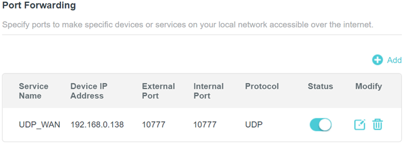

# Scenario 1: Direct Peer-to-Peer Communication with Public IP Address

This scenario demonstrates WAN communication when one DomainParticipant is reachable at a public IP address. This is the simplest WAN deployment scenario.

The *Passive* RTI Routing Service listens for incoming communications. The *Active* RTI Routing Service uses the known public address and port of the *Passive* side to initiate discovery.

In this scenario, only Domain 1 is secured. Operating room applications from Module 01 run in non-secured mode locally on Domain 0, while WAN communication uses authentication and encryption on Domain 1. In a production deployment, you may choose to secure the local traffic as well or just the remote traffic as demonstrated here.


## Setup and Installation

### 1. See Module 01 Setup and Installation

[Installation and build steps from Module 01: Digital Operating Room](../01-operating-room/README.md#setup-and-installation) satisfy prerequisites for this module.

### 2. Install RTI Real-Time WAN Transport

The RTI Real-Time WAN Transport is available as an add-on product. Follow the [RTI Real-Time WAN Transport Installation Guide](https://community.rti.com/static/documentation/connext-dds/7.3.0/doc/manuals/addon_products/realtime_wan_transport/installation_guide/index.htm) to install the transport plugin on both machines.

### 3. Security (optional)

Generate the security artifacts (CA certificates, identity certificates, and signed governance/permissions XML). See the [Security README](../../system_arch/security/README.md) for full details.

```bash
python3 system_arch/security/setup_security.py
```

**You should generate the security artifacts once and then distribute to whichever machines are used to run the demo applications. This ensures the certificates can be correctly verified across machines during DomainParticipant authentication.**

### 4. Network Configuration

On both *Passive* and *Active* sides, set the following environment variables before running the scenario. `NDDSHOME` must already be set from your Connext installation (see [Module 01 Setup](../01-operating-room/README.md#setup-and-installation)).

| Variable         | Value                                                                                  | Default        |
|------------------|----------------------------------------------------------------------------------------|----------------|
| `PUBLIC_ADDRESS` | Publicly accessible IP address of the *Passive* side.                                  | ***(required)*** |
| `PUBLIC_PORT`    | Publicly accessible/forwarded port of the *Passive* side.                              | 10777          |
| `INTERNAL_PORT`  | Internal/forwarded port of the *Passive* side. This may be the same as `PUBLIC_PORT`. | 10777          |

`PUBLIC_PORT` and `INTERNAL_PORT` default to `10777` in the XML configuration and only need to be set if you are forwarding a different port. `PUBLIC_ADDRESS` has no default and **must** be set, or the service will fail to start.

```bash
# Linux / macOS
export PUBLIC_ADDRESS=<public IP address of passive side>
export PUBLIC_PORT=10777       # only needed if not using the default
export INTERNAL_PORT=10777     # only needed if not using the default

# Windows Command Prompt
set PUBLIC_ADDRESS=<public IP address of passive side>
set PUBLIC_PORT=10777
set INTERNAL_PORT=10777
```

You must then configure UDP port forwarding on your *Passive* side router between `PUBLIC_PORT` and `INTERNAL_PORT` to expose your DDS applications on the WAN.
For example:



## Run the Scenario

*Note: This scenario will not work if different certificate sets are used on each side when using Security.*

### 1. Launch Active Side Applications

From the machine *not* publicly exposed, start the teleop Arm Controller as the *Active* side:

```bash
python3 launch.py 01-operating-room ArmController
```

### 2. Launch Passive Side Applications

From the machine *publicly* exposed, start the Operating Room applications as the *Passive* side:

```bash
python3 launch.py 01-operating-room Orchestrator PatientSensor Arm PatientMonitor
```

>**Observe:** You should see **no communication** between applications since the Routing Service infrastructure has not been started yet.

### 3. Launch Passive Routing Service

In a new terminal on the *Passive* side:

```bash
python3 launch.py 03-remote-teleoperation RsPassive [-s]
```

### 4. Launch Active Routing Service

In a new terminal on the *Active* side:

```bash
python3 launch.py 03-remote-teleoperation RsActive [-s]
```

### 5. Observe Communication

[Observe the operating room applications](../01-operating-room/README.md#2-observe-the-application-behavior) to verify that all *Module 01: Digital Operating Room* functionality works across the WAN.

>**Observe:** Once discovery completes, you should see data flow between the Operating Room applications and the Arm Controller. RTI Routing Service provides scalability by bridging between the local networks over the WAN and avoids managing a separate WAN connection for each set of remote applications that communicate.

### 6. Kill the applications

Press `Ctrl-C` in each terminal to terminate the running applications.
