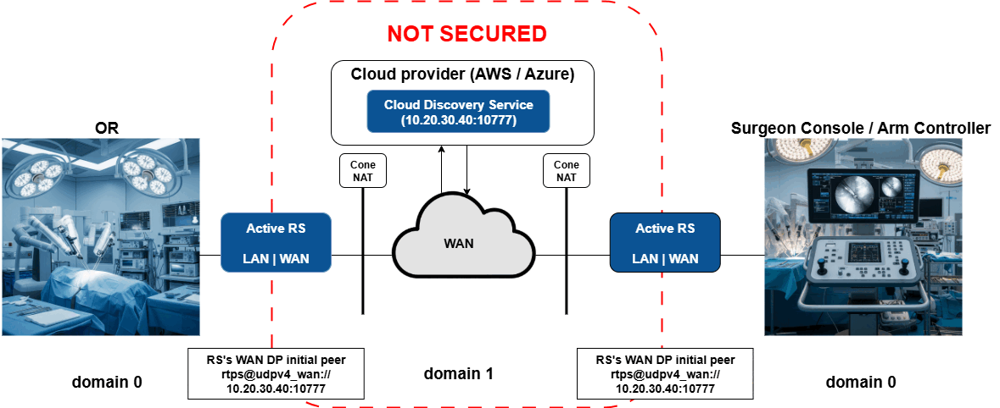
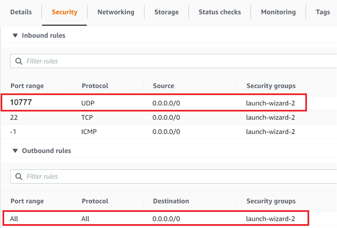

# Scenario 2: Direct Peer-to-Peer Communication Using RTI Cloud Discovery Service

This scenario demonstrates WAN communication when both DomainParticipants are behind cone NATs and cannot reach each other directly. RTI Cloud Discovery Service is run on a publicly accessible cloud instance to facilitate discovery between the *Active* RTI Routing Services.

The *Active* Routing Services initiate discovery towards the public *Cloud* instance. Cloud Discovery Service facilitates discovery between both NAT-protected *Active* Routing Services, which in turn establishes peer-to-peer communication.

In this scenario, only Domain 1 is secured. Operating room applications from Module 01 run in non-secured mode locally on Domain 0, while WAN communication uses authentication and encryption on Domain 1. In a production deployment, you may choose to secure the local traffic as well or just the remote traffic as demonstrated here.

Make sure the shared setup in the root [Quick Start](../../README.md#quick-start) section is complete and that Module 01 is already working before you try this scenario.



## Setup and Installation

**This scenario requires the *OR's* and the *Arm Controller's* NATs to be cone NATs. You can use the NAT type checker script in [resource/nat_type_checker](../../resource/nat_type_checker) to make sure you have cone NATs.**

Complete the shared setup in the root [Quick Start](../../README.md#quick-start) section. This scenario then adds the WAN transport, cloud instance, security, and network configuration below.

Module-specific notes:

- If you plan to use secure mode, make sure the security artifacts from the root README have been generated.

### 1. Install RTI Real-Time WAN Transport

RTI Real-Time WAN Transport is available as an add-on product. Follow the [RTI Real-Time WAN Transport Installation Guide](https://community.rti.com/static/documentation/connext-dds/7.3.0/doc/manuals/addon_products/realtime_wan_transport/installation_guide/index.htm) to install the transport plugin on both machines.

### 2. Setup Cloud Instance

On your publicly reachable cloud instance, install the RTI Connext host, the Real-Time WAN Transport, Cloud Discovery Service and RTI Security Plugins packages.

1. To install Connext host, follow the [installation guide](https://community.rti.com/static/documentation/connext-dds/7.3.0/doc/manuals/connext_dds_professional/installation_guide/installation_guide/Installing.htm#Chapter_1_Installing_RTI%C2%A0Connext) and install only the host bundle (there is no need to install a target bundle).
2. RTI Real-Time WAN Transport is available as an add-on product. Follow the [RTI Real-Time WAN Transport Installation Guide](https://community.rti.com/static/documentation/connext-dds/7.3.0/doc/manuals/addon_products/realtime_wan_transport/installation_guide/index.htm). to install the transport plugin. You will only need the host bundle.
3. Cloud Discovery Service is available as an add-on component. Follow the [RTI Cloud Discovery Service Installation Guide](https://community.rti.com/static/documentation/connext-dds/7.3.0/doc/manuals/addon_products/cloud_discovery_service/installation.html).
4. If using Security, install the host bundle for both OpenSSL and RTI Security Plugins.

### 3. Security (optional)

The shared trusted security artifacts are covered in the root [Quick Start](../../README.md#quick-start). Complete that setup before running this scenario, then distribute the generated artifacts to whichever machines are used to run the demo applications.

**You should generate the security artifacts once and then distribute to whichever machines are used to run the demo applications. This ensures the certificates can be correctly verified across machines during DomainParticipant authentication.**

### 4. Network Configuration

On the *Active* sides and on your cloud instance, set the following environment variables before running the scenario. `NDDSHOME` must already be set from your Connext installation (see [Module 01 Setup](../01-operating-room/README.md#setup-and-installation)).

| Variable         | Value                                                                                 | Default        |
|------------------|---------------------------------------------------------------------------------------|----------------|
| `PUBLIC_ADDRESS` | Publicly accessible IP address of the cloud instance.                                 | ***(required)*** |
| `PUBLIC_PORT`    | Publicly accessible/forwarded port of the cloud instance.                             | 10777          |

`PUBLIC_PORT` defaults to `10777` in the XML configuration and only needs to be set if you are forwarding a different port. `PUBLIC_ADDRESS` has no default and **must** be set, or the service will fail to start.

```bash
# Linux / macOS
export PUBLIC_ADDRESS=<cloud instance public IP>
export PUBLIC_PORT=10777       # only needed if not using the default

# Windows Command Prompt
set PUBLIC_ADDRESS=<cloud instance public IP>
set PUBLIC_PORT=10777
```

You will need to add a security rule on your cloud instance to allow incoming/outgoing traffic on `PUBLIC_PORT` for the UDP protocol. For example:



## Run the Scenario

> Important: Run the commands below from the repository root. `launch.py` lives at the project root and is the single runtime entrypoint for this project.

*Note: This scenario will not work if different certificate sets are used on each side when using Security.*

### 1. Launch Active Side Applications

From one machine, start the teleop Arm Controller:

```bash
# From the repository root
python3 launch.py 01-operating-room ArmController
```

### 2. Launch Passive Side Applications

From the other machine, start the Operating Room applications:

```bash
# From the repository root
python3 launch.py 01-operating-room Orchestrator PatientSensor Arm PatientMonitor
```

>**Observe:** You should see **no communication** between applications since the Routing Service and Cloud Discovery Service infrastructure has not been started yet.

### 3. Launch Cloud Discovery Service

In a terminal on your cloud instance, run Cloud Discovery Service:

```bash
# From the repository root
python3 launch.py 03-remote-teleoperation CdsCloud [-s]
```

### 4. Launch Active Routing Services

Open a new terminal on both *Active* sides and run the following in each:

```bash
# From the repository root
python3 launch.py 03-remote-teleoperation RsActive [-s]
```

### 5. Observe Communication

[Observe the operating room applications](../01-operating-room/README.md#2-observe-the-application-behavior) to verify that all *Module 01: Digital Operating Room* functionality works across the WAN.

>**Observe:** Once discovery completes, you should see data flow between the Operating Room applications and the Arm Controller. RTI Cloud Discovery Service facilitates discovery between the *Active* Routing Services, allowing them to establish peer-to-peer communication. RTI Routing Service provides scalability by bridging between the local networks over the WAN and avoids managing a separate WAN connection for each set of remote applications that communicate.

### 6. Kill the applications

Press `Ctrl-C` in each terminal to terminate the running applications.
