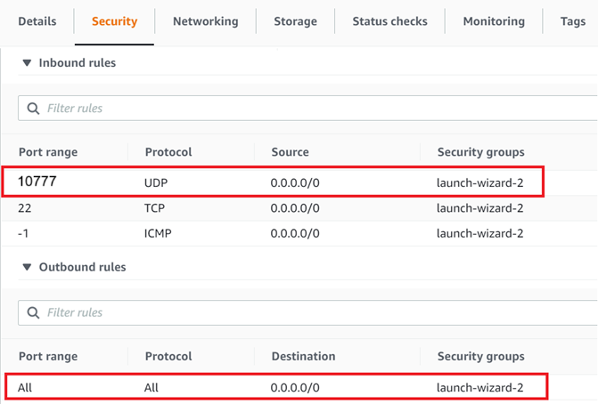

# Scenario 3: Relayed Communication Using RTI Routing Service

This scenario demonstrates WAN communication when both DomainParticipants are behind NATs (symmetric or cone NATs) and cannot reach each other directly. A cloud-based *Passive* RTI Routing Service acts as a relay to route communication between the *Active* RTI Routing Services.

The *Active* RTI Routing Services initiate discovery towards the public cloud instance. The cloud-based *Passive* RTI Routing Service relays communication between both NAT-protected *Active* Routing Services.

This scenario does **not** require the *OR's* and the *Arm Controller's* NATs to be cone NATs, making it the most flexible deployment option. However, the communication between local networks is not direct over the WAN, and is instead bridged by the cloud-based RTI Routing Service instance.

In this scenario, only Domain 1 is secured. Operating room applications from Module 01 run in non-secured mode locally on Domain 0, while WAN communication uses authentication and encryption on Domain 1. In a production deployment, you may choose to secure the local traffic as well or just the remote traffic as demonstrated here.


## Setup and Installation

### 1. See Module 01 Setup and Installation

[Installation and build steps from Module 01: Digital Operating Room](../01-operating-room/README.md#setup-and-installation) satisfy prerequisites for this module.

### 2. Install RTI Real-Time WAN Transport

The RTI Real-Time WAN Transport is available as an add-on product. Follow the [RTI Real-Time WAN Transport Installation Guide](https://community.rti.com/static/documentation/connext-dds/7.3.0/doc/manuals/addon_products/realtime_wan_transport/installation_guide/index.htm) to install the transport plugin on both machines.

### 3. Setup Cloud Instance

On your publicly reachable cloud instance, install the RTI Connext host and the RTI Real-Time WAN Transport packages.

1. To install Connext host, follow the [installation guide](https://community.rti.com/static/documentation/connext-dds/7.3.0/doc/manuals/connext_dds_professional/installation_guide/installation_guide/Installing.htm#Chapter_1_Installing_RTI%C2%A0Connext) and install only the host bundle (there is no need to install a target bundle).
2. RTI Real-Time WAN Transport is available as an add-on product. Follow the [RTI Real-Time WAN Transport Installation Guide](https://community.rti.com/static/documentation/connext-dds/7.3.0/doc/manuals/addon_products/realtime_wan_transport/installation_guide/index.htm) to install the transport plugin.

### 4. Security (optional)

Generate security artifacts for WAN communication.
This includes identity certificates, private keys, and the signing of DDS Security XML permissions & governance files located in [system_arch/security](../../system_arch/security).

**You should generate the security artifacts once and then distribute to whichever machines are used to run the demo applications. This ensures the certificates can be correctly verified across machines during DomainParticipant authentication.**

### 5. Network Configuration

On the *Active* sides and on your cloud instance, configure these variables in [variables.sh](./scripts/variables.sh)/[variables.bat](./scripts/variables.bat):

| Variable         | Value                                                                                 | Default |
|------------------|---------------------------------------------------------------------------------------|---------|
| `NDDSHOME`       | RTI Connext installation path.                                                        |         |
| `PUBLIC_ADDRESS` | Publicly accessible IP address of the cloud instance.                                 |         |
| `PUBLIC_PORT`    | Publicly accessible/forwarded port of the cloud instance.                             | 10777   |
| `INTERNAL_PORT`  | Internal/forwarded port of the cloud instance. This may be the same as `PUBLIC_PORT`. | 10777   |

You will need to add a security rule on your cloud instance to allow incoming/outgoing traffic on `PUBLIC_PORT` for the UDP protocol. For example:



## Run the Scenario

*Note: This scenario will not work if different certificate sets are used on each side.*

### 1. Launch Active Side Applications

From one machine, start the teleop Arm Controller:

```bash
cd 01-operating-room
./scripts/launch_arm_controller.sh
```

### 2. Launch Passive Side Applications

From the other machine, start the Operating Room applications:

```bash
cd 01-operating-room
./scripts/launch_OR_apps.sh
```

>**Observe:** You should see **no communication** between applications since the RTI Routing Service infrastructure has not been started yet.

### 3. Security Configuration (if using Security)

If using Security, on the *Active* sides, make sure that lines 68-79 of [`RsConfigActive.xml`](xml_config/RsConfigActive.xml) are commented out.

### 4. Launch Cloud Routing Service

In a terminal on your cloud instance, run the *Passive* RTI Routing Service:

```bash
cd 03-remote-teleoperation
./scripts/launch_rs_cloud.sh [-s]
```

### 5. Launch Active Routing Services

Open a new terminal on both *Active* sides and run the following in each:

```bash
cd 03-remote-teleoperation
./scripts/launch_rs_active.sh [-s]
```

### 6. Observe Communication

[Observe the operating room applications](../01-operating-room/README.md#3-observe-the-demo-applications) to verify that all *Module 01: Digital Operating Room* functionality works across the WAN.

>**Observe:** Once discovery completes, you should see data flow between the Operating Room applications and the Arm Controller. The cloud-based RTI Routing Service acts as a relay, facilitating communication between both NAT-protected sides. RTI Routing Service provides scalability by bridging between the local networks over the WAN and avoids managing a separate WAN connection for each set of remote applications that communicate.

### 7. Kill the applications

Kill all running applications:

```bash
../01-operating-room/scripts/kill_all.sh
```
