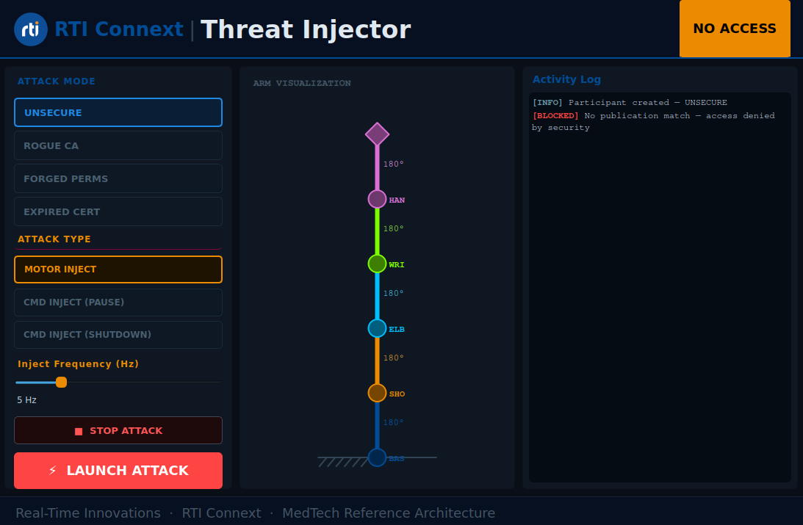
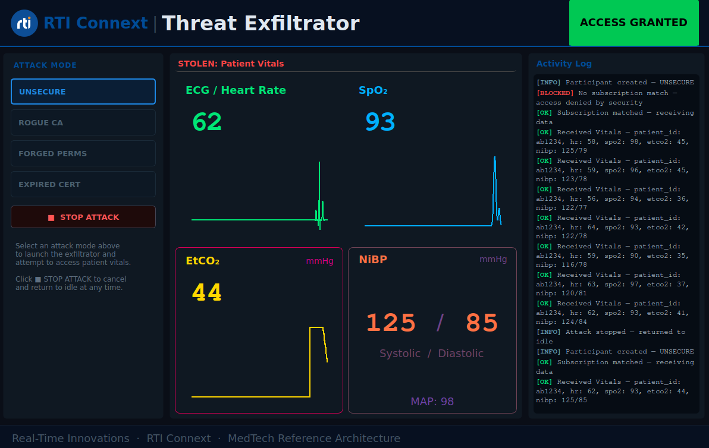

# Module 04: Security Threat Demonstration

This module demonstrates the security properties of RTI Connext by showing what happens when a malicious application attempts to tamper with surgical arm control commands or steal patient vital signs. Run it alongside [Module 01: Digital Operating Room](../01-operating-room/README.md) to observe attacks succeeding against an unsecured deployment and being blocked by DDS Security in a secured one.

*Note, this module was developed and tested on Debian 11 (Bullseye) and Ubuntu 22.04 running under WSL2 on Windows 11. The instructions below assume a Debian/Ubuntu environment.*

All run commands in this README are launched from the repository root. The project-level `launch.py` script is the runtime entrypoint; there is no module-local launcher in this folder.

## Contents

- [Module Description](#module-description)
- [Setup and Installation](#setup-and-installation)
- [Run the Demo](#run-the-demo)
- [Hands-On: Going Further](#hands-on-going-further)
- [Next Steps](#next-steps)

---

## Module Description

Two Python GUI applications simulate different real-world attack scenarios against the operating room DDS bus.

### Threat Injector



The *Threat Injector* application publishes fabricated commands on Topics `t/MotorControl` and `t/DeviceCommand`, simulating an attacker attempting to disrupt the surgical arm or seize device control. It provides a GUI to select:

- **Attack Mode**. Each of these modes affects whether the DDS Security handshake succeeds or fails. See [Understanding Why Each Attack Is Blocked](#2-understanding-why-each-attack-is-blocked) to understand why the handshake and the attack can fail:
  - Unsecure
  - Rogue CA
  - Forged Permissions
  - Expired Certificate
- **Attack Type**:
  - Motor Inject. This triggers continuous erratic joint commands at a configurable frequency.
  - Command Inject PAUSE (one-shot)
  - Command Inject SHUTDOWN (one-shot)
- **Frequency Slider**
  - The slider controls how many times per second the Motor Inject attack writes samples.
  - This is only enabled when Motor Inject is selected and an attack is not already running.

Attack status is derived from `publication_matched_status` — the app checks whether its DataWriters have matched any remote subscribers. If a subscriber matches (unsecured OR is running), the status badge shows **ATTACKING** (green) and log entries appear as `[OK]`. If no subscriber matches (secured OR blocks the handshake), the status badge shows **NO ACCESS** (orange) and log entries appear as `[WARN]`.

An arm visualization panel shows the injected motor commands in real time. The panel renders in color when an attack mode is active and in grey when idle.

### Threat Exfiltrator



The *Threat Exfiltrator* application subscribes to the `t/Vitals` topic, displaying patient vital signs as if harvesting them for unauthorised use. Attack status is derived from `subscription_matched_status` — when the exfiltrator's DataReader matches a remote publisher, the status badge shows **ACCESS GRANTED** and live heart rate, SpO₂, EtCO₂, and NiBP values stream in. When no match occurs (secured OR), the vitals panels show `---` and the status badge shows **NO ACCESS**.

### Status States

Both applications use the following status states:

| Status | Color | Meaning |
| --- | --- | --- |
| **IDLE** | ⚪ **Grey** | No attack mode selected |
| **ACCESS GRANTED** | 🟢 **Green** | DDS matched — data path is open |
| **ATTACKING** | 🟢 **Green** | Actively writing samples that reach a subscriber (injector only) |
| **NO ACCESS** | 🟠 **Orange** | No DDS match — security or configuration is blocking the connection |
| **ATTACK FAILED** | 🔴 **Red** | Participant creation itself failed (e.g. expired certificate rejected at startup) |

---

## Setup and Installation

Complete the shared setup in the root [Quick Start](../../README.md#quick-start) section. This module reuses the operating room applications from Module 01, so make sure that workflow is already working before you begin.

Module-specific setup:

The shared trusted system security artifacts are covered in the root [Quick Start](../../README.md#quick-start). Complete that setup first so the generated keys and trust stores are available on whichever machines will run this module.

Generate the module-specific threat artifacts from the repository root:

```bash
# From the repository root
python3 modules/04-security-threat/security/setup_threat_security.py
```

*Note, the **Forged Permissions** and **Expired Certificate** attack modes require the trusted system CA private keys (e.g. `system_arch/security/ca/TrustedIdentityCa/private/TrustedIdentityCa.key`). These keys are generated when you complete the shared security setup in the root README and are used only for laboratory demonstration of how certificate chains can be abused. Keep them secure in any real deployment.*

Ensure the RTI Security Plugins are installed on every machine that will run a secured participant.

---

## Run the Demo

> Important: Run the commands below from the repository root. `launch.py` lives at the project root and is the single runtime entrypoint for this project.

### 1. Run Operating Room Applications

Open a terminal and launch Module 01 from the repository root in either unsecured or secured mode:

```bash
# From the repository root
# Unsecured (attacks will SUCCEED):
python3 launch.py 01-operating-room

# Secured (attacks will be BLOCKED):
python3 launch.py 01-operating-room -s
```

### 2. Run a Threat Application

Open a second terminal and launch the desired threat application:

```bash
# From the repository root
# Launch the Threat Injector:
python3 launch.py 04-security-threat ThreatInjector

# OR launch the Threat Exfiltrator:
python3 launch.py 04-security-threat ThreatExfiltrator
```

### 3. Observe the Application Behavior

1. Select an **Attack Mode** (this creates the DDS participant and enables the attack type and launch controls).
2. Select an **Attack Type** (defaults to Motor Inject).
3. Click **LAUNCH ATTACK**.

The Activity Log and status badge update in real time.

| Scenario | OR mode | Attack mode | Threat app | OR app |
| --- | --- | --- | --- | --- |
| Motor inject | Unsecured | Unsecure | Status: **ATTACKING**; `[OK]` log entries; arm viz moves | *Arm* GUI moves erratically |
| Motor inject | Secured | Rogue CA | Status: **NO ACCESS**; `[WARN]` log entries; arm viz moves locally | *Arm* unaffected |
| Motor inject | Secured | Forged Perms | Status: **NO ACCESS**; `[WARN]` log entries; arm viz moves locally | *Arm* unaffected |
| Motor inject | Secured | Expired Cert | Status: **ATTACK FAILED**; participant creation blocked | *Arm* unaffected |
| Vitals exfiltrate | Unsecured | Unsecure | Status: **ACCESS GRANTED**; vitals panels populate | *Patient Monitor* continues normally |
| Vitals exfiltrate | Secured | Rogue CA | Status: **NO ACCESS**; vitals panels show `---` | *Patient Monitor* continues normally |
| Vitals exfiltrate | Secured | Expired Cert | Status: **ATTACK FAILED**; participant creation blocked | *Patient Monitor* continues normally |

> **Observe:** When the OR is running in unsecured mode and you select **Motor Inject → LAUNCH ATTACK**, the *Arm* GUI in Module 01 begins receiving the fabricated commands and the arm visualization moves erratically — even though no legitimate operator is sending commands. Switch the OR to secured mode (restart with `-s`) and repeat: the arm in Module 01 is completely unaffected, and the injector's status changes to **NO ACCESS**.
>
> **Observe:** When you switch between Rogue CA and Forged Permissions modes, both result in **NO ACCESS** because the DDS Security handshake fails at different stages — but the observable result from the threat app's perspective is the same: no publication match, no data flowing.

### 4. Kill the Applications

Press `Ctrl-C` in each terminal to terminate the running applications.

---

## Hands-On: Going Further

### 1. Comparing Unsecured vs. Secured Behavior

While the injector is actively attacking in **Unsecure** mode against the unsecured OR (status: **ATTACKING**, green), restart the OR applications in secured mode without stopping the threat app:

```bash
# From the repository root
# Press Ctrl-C to stop the running OR apps, then relaunch with security:
python3 launch.py 01-operating-room -s
```

Watch the threat app's Activity Log: when the secured OR comes up, the injector's `publication_matched_status` drops to zero and the status badge transitions from **ATTACKING** to **NO ACCESS**. The `[OK]` log entries become `[WARN]`, indicating writes are still happening locally but no subscriber is receiving them.

### 2. Understanding Why Each Attack Is Blocked

Each attack mode corresponds to a different stage of the DDS Security handshake:

| Mode | What happens | Why |
| --- | --- | --- |
| **Rogue CA** | Participant is created but never matches | The identity certificate is signed by an untrusted CA root. The OR participants do not list the rogue CA in their `identity_ca` trust store, so the authentication handshake fails. |
| **Forged Permissions** | Participant is created but never matches | Authentication succeeds (identity signed by trusted CA), but the permissions document is signed by the rogue CA. Since the OR's `permissions_ca` is the trusted CA, the signature mismatch causes access control validation to fail. |
| **Expired Certificate** | Participant creation fails immediately | The identity certificate was signed by the trusted CA but its `notAfter` field is in the past. The DDS Security authentication plugin validates certificate expiration during identity validation — for the local participant, this occurs during DomainParticipant creation, causing it to fail immediately. The status badge shows **ATTACK FAILED** (red). |

For a deeper dive into the DDS Security handshake, refer to the [RTI Security Plugins User's Manual](https://community.rti.com/static/documentation/connext-dds/7.3.0/doc/manuals/connext_dds_secure/users_manual/index.htm).

---

## Next Steps

- **Module 02: Record and Playback** — Record a session of the operating room in action, then replay it for analysis or training.
- **Module 03: Remote Teleoperation** — Extend the secure architecture across a WAN link to support remote surgical assistance.

Head back to the [main README](../../README.md) and pick up with the [Hands-On: Architecture](../../README.md#hands-on-architecture) section to learn more about the system architecture.
